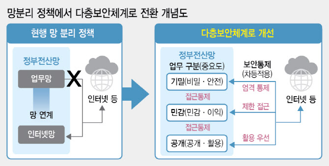

# 국정원, 망분리 규제 완화 MLS 로드맵 공개

국가 공공기관이 인공지능(AI) 등 신기술을 활용할 수 없게 막아온 획일적인 ‘망분리 정책’이 사라지고, 업무 중요도에 따라 적절한 보안 조치를 갖추면 외부 인터넷 망과 연결해 업무를 볼 수 있게 하는 ‘다층보안체계(MLS)’가 내년부터 도입된다. 주무 기관인 국가정보원은 공공기관 대상 보안 가이드를 개발해 공표하는 한편, 공공기관의 IT 시스템 도입과 관련된 제도인 클라우드 보안인증(CSAP)과 공공보안검증 제도도 재정비해 원활한 MLS로의 전환을 이루겠다는 계획이다.

 

## 정리

1. 망분리 시스템은 보안성은 우수하나 
2. AI, 클라우드 등 신기술 활용이 어렵고 공공 데이터 공유 활성화를 어렵게 했다.
3. 대통령의 “AI시대 폭넓은 공공데이터 활용체계를 갖추라”는 지시에 따라 정책 개선을 시작했고
4. 망분리 대안은 MLS이다.
5. MLS은 
    - 업무의 중요도에 따라 기밀(C), 민감(S), 공개(O) 등급으로 분류하고 
    - 등급별로 차등적인 보안 통제를 적용해
    - 보안성을 확보하는 동시에 인터넷 단절 없는 업무 환경 구축을 목표로 한다
6. 국정원이 발표한 MLS 전환은 5단계를 걸쳐 적용된다
    - △정보 서비스 현황 파악·분석
    - △업무 중요도에 따라 정보시스템 대상 C·S·O 등급분류 
    - △정보시스템 모델링 
    - △모델링 토대 보안대책 수립 
    - △적절성 평가·조정 
7. 국정원은 업무 정보의 C·S·O 등급분류 기준도 공개했다.
    - 기밀(C), 민감(S) 정보에는 정보공개법과 공공데이터법 등에 따라서 각급 기관이 지정한 비공개 정보가 해당
    - 공개(O) 정보는 기밀·민감 정보 이외에 것과 민감 정보 중에서도 가명 처리한 것이 분류
8. 자세한 내용은 개정·제정 후에 참고하면 된다
    - MLS 관련 보안 가이드라인
    - 국가정보보안기본지침
    - 전 국가 공공기관 대상 지침
9. 국정원은    
    - 올해까지 MLS 기반을 구체화하고 
    - 내년부터 시행함과 동시에 고도화해 
    - 2026년부터 전환을 가속화한다는 계획이다.
10. MLS 도입으로 영향을 받는 공공 보안 제도도 재정비한다.    
    - IT 기업이 공공 기관에 클라우드 제품을 공급할 때 획득해야 하는 ‘CSAP’도 정비한다.
    - 공공 기관별로 보안 등급을 나눈 현행 공공 보안검증 제도도 CSO를 적용해 일괄 정비한다.
11. 국정원 관계자는 MLS 전환으로 “국가 공공기관 시스템에 AI와 클라우드가 연계되면서 공무원들의 업무 효율성이 제고되고, 민간에서 우수한 공공 서비스가 다양하게 개발될 것으로 본다”고 기대했다.

## 본문 
# 케케묵은 '망분리' 내년엔 사라진다…국정원, MLS 로드맵 공개   
https://www.edaily.co.kr/News/Read?newsId=03781846639019136&mediaCodeNo=257
   

국가 공공기관이 인공지능(AI) 등 신기술을 활용할 수 없게 막아온 획일적인 ‘망분리 정책’이 사라지고, 업무 중요도에 따라 적절한 보안 조치를 갖추면 외부 인터넷 망과 연결해 업무를 볼 수 있게 하는 ‘다층보안체계(MLS)’가 내년부터 도입된다. 주무 기관인 국가정보원은 공공기관 대상 보안 가이드를 개발해 공표하는 한편, 공공기관의 IT 시스템 도입과 관련된 제도인 클라우드 보안인증(CSAP)과 공공보안검증 제도도 재정비해 원활한 MLS로의 전환을 이루겠다는 계획이다.

국정원은 11일 서울 삼성동 코엑스에서 국제 사이버안보 행사인 ‘사이버 서밋 코리아 (CSK) 2024‘를 개최하고, 이같은 내용을 담은 ’국가망보안정책 개선 로드맵(안)‘을 공개했다.

국정원을 중심으로 디지털플랫폼정부위원회, 금융위원회, 개인정보보호위원회 등 관계부처와 산학연은 지난 1월 망분리 정책 개선 작업에 착수했다. 망분리는 보안이 요구되는 업무망에서는 인터넷을 사용할 수 없게 차단하고, 인터넷 접속이 필요한 경우 업무망과 분리된 별도의 PC를 사용하도록한 보안 정책이다.

이 같은 방식이 보안성은 우수하나 AI, 클라우드 기반 소프트웨어(SaaS) 등 신기술 활용이 어렵고, 공공 데이터 공유 활성화를 어렵게 한다는 지적이 컸다. 이에 작년 12월 윤석열 대통령이 “AI시대 폭넓은 공공데이터 활용체계를 갖추라”는 지시에 따라 국가 망보안 정책의 전면 개선이 시작됐다.

망분리 정책의 대안으로 도입된 MLS는 업무의 중요도에 따라 시스템을 기밀(C), 민감(S), 공개(O) 등급으로 분류하고, 등급별로 차등적인 보안통제를 적용해 보안성을 확보하는 동시에 인터넷 단절 없는 업무 환경을 구현하는 것을 목표로 한다.

이날 국정원이 발표한 로드맵(안)에 따르면 MLS 전환은 △정보 서비스 현황 파악·분석 △업무 중요도에 따라 정보시스템 대상 C·S·O 등급분류 △정보시스템 모델링 △모델링 토대 보안대책 수립 △적절성 평가·조정 등 5 단계를 걸쳐 적용된다.

국정원은 업무 정보의 C·S·O 등급분류 기준도 공개했다. 기밀·민감 정보에는 정보공개법과 공공데이터법 등에 따라서 각급 기관이 지정한 비공개 정보가 해당된다. 공개 정보는 기밀·민감 정보 이외에 것과 민감 정보 중에서도 가명 처리한 것이 분류된다.

업무 정보가 운영되는 시스템의 등급 기준도 밝혔다. 여러 등급의 정보가 섞여 있을 경우 상위 등급 기준으로 시스템 기준을 분류한다는 원칙이다. 예컨대 S등급과 O등급 정보가 섞여 있는 시스템은 S등급이 된다.

국정원은 올해까지 MLS 기반을 구체화하고 내년부터 시행함과 동시에 고도화해, 2026년부터 전환을 가속화한다는 계획이다. 이를 위해 국가정보보안기본지침과 MLS 관련 보안 가이드라인을 개정·제정하고, 내년 상반기에 전 국가 공공기관 대상 지침을 공표한다. 이후에도 지속적으로 보안 가이드라인은 개발해 공표할 예정이다.

또 MLS 도입으로 영향을 받는 공공 보안 제도도 재정비한다. IT 기업이 공공 기관에 클라우드 제품을 공급할 때 획득해야 하는 ‘CSAP’도 정비한다. 내년 상반기까지 현행 CSAP의 상·중·하 보안 기준을 CSO 개념으로 재정립해, 인증 반복을 없애고 간소화한다는 계획이다. 더불어 공공 기관별로 보안 등급을 나눈 현행 공공 보안검증 제도도 CSO를 적용해 일괄 정비한다. 연내 개편안을 마련하고 내년에 공청회를 통해 각계 의견도 수렴해 시행할 계획이다.

국정원 관계자는 MLS 전환으로 “국가 공공기관 시스템에 AI와 클라우드가 연계되면서 공무원들의 업무 효율성이 제고되고, 민간에서 우수한 공공 서비스가 다양하게 개발될 것으로 본다”고 기대했다.

이날 윤석열 대통령은 CSK2024 행사에 참석해 망분리 정책 개선을 언급하며 “(정부는) 초연결 AI시대에 맞춰 공공데이터를 빠르고 폭넓게 활용할 수 있도록 정부 전산망 보안 정책과 암호 사용 정책을 글로벌스탠다드에 맞게 과감히 개선하고 있다”고 강조했다.