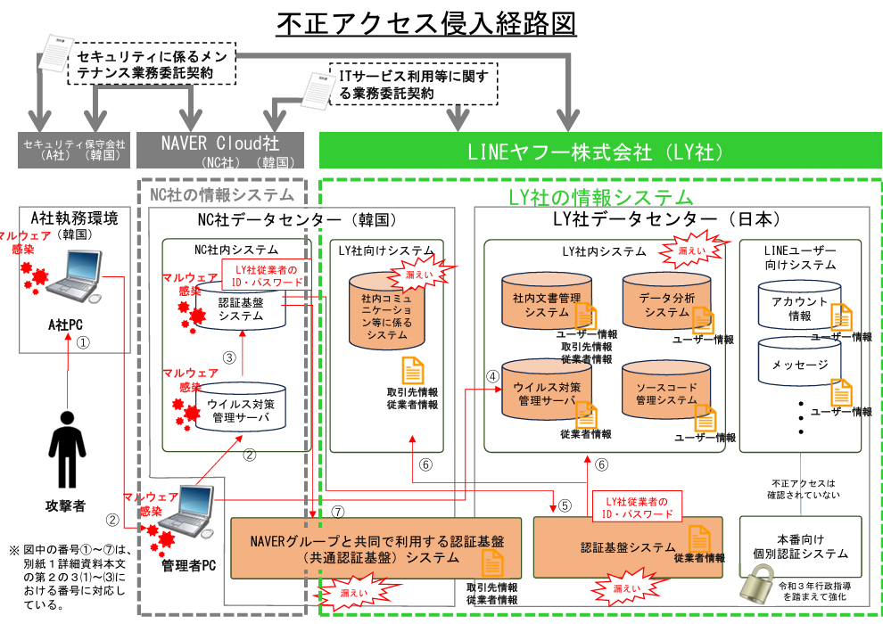
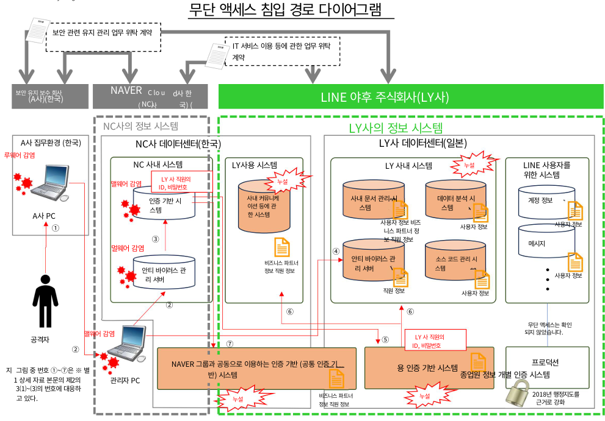

# 라운야후 개인정보 유출사태 정리

## 정리
네이버 자회사의 보안업체 직원의 개인 단말이 악성코드에 감염되어 해킹사건이 시작
1. 네이버 자회사 보안업체의 업무 컴퓨터에 악성코드 감염.
2. 네이버 자회사 보안업체의 PC에서 네이버 클라우드 관리자 PC에 악성코드 감염.
2-1. 네이버 관리자 PC에서 안티 바이러스 관리 서버에 악성코드 감염.
3. 안티 바이러스 관리 서버에서 인증 기반 시스템에 악성코드 감염.
4. 네이버 관리자 PC에서 라인야후 안티 바이러스 관리 서버로 해킹.
5. 네이버 인증 기반 시스템에서 탈취한 라인야후 직원의 ID, 비밀번호를 이용하여 라인야후 인증 기반 시스템에 접근. (종업원 정보 탈취)
6. 라인야후 인증 기반 시스템에서 라인 사 직원의 ID, 비밀번호를 이용해 라인 사내 시스템 및 라인 사용 시스템에 접근. (직원 정보, 거래처 정보 및 종업원 정보, 사용자 정보 탈취)
7. 네이버 인증 기반 시스템에서 NAVER 그룹과 공동으로 이용하는 인증 기반(공통 인증 기반) 시스템 접근.(거래처 정보 및 종업원 정보 탈취)

일본 개인정보보호위원회 게시 자료 참조   
https://www.ppc.go.jp/files/pdf/240328_houdou.pdf

  

# 해결방안
1. 네이버 자회사 보안업체 직원의 개인 단말기 보안 인식 제고
2. 네이버 자회사 보안업체 개인 단말기와 업무 PC 간 망분리
3. 네이버 관리자 PC에서 라인야후 인증 기반 시스템에 접근할 수 있는 계정에 대한 불필요한 권한 차단
4. 네이버에서 라인으로 접근하는 계정 중 업무목적 상 필요 IP만 허용, 추가 인증 수단 적용

 

## 법적 근거
- 개인정보보호법 제29조(안전조치의무) 
    - 개인정보처리자는 개인정보가 분실ㆍ도난ㆍ유출ㆍ위조ㆍ변조 또는 훼손되지 아니하도록 내부 관리계획 수립, 접속기록 보관 등 대통령령으로 정하는 바에 따라 안전성 확보에 필요한 기술적ㆍ관리적 및 물리적 조치를 하여야 한다.
- 개인정보보호법 시행령 제30조(개인정보의 안전성 확보 조치)제1항
    - ① 개인정보처리자는 법 제29조에 따라 다음 각 호의 안전성 확보 조치를 해야 한다.
        1. 개인정보의 안전한 처리를 위한 다음 각 목의 내용을 포함하는 내부 관리계획의 수립ㆍ시행 및 점검
            - 가. 법 제28조제1항에 따른 개인정보취급자(이하 “개인정보취급자”라 한다)에 대한 관리ㆍ감독 및 교육에 관한 사항
            - 나. 법 제31조에 따른 개인정보 보호책임자의 지정 등 개인정보 보호 조직의 구성ㆍ운영에 관한 사항
            - 다. 제2호부터 제8호까지의 규정에 따른 조치를 이행하기 위하여 필요한 세부 사항
        2. 개인정보에 대한 접근 권한을 제한하기 위한 다음 각 목의 조치
            - 가. 데이터베이스시스템 등 개인정보를 처리할 수 있도록 체계적으로 구성한 시스템(이하 “개인정보처리시스템”이라 한다)에 대한 접근 권한의 부여ㆍ변경ㆍ말소 등에 관한 기준의 수립ㆍ시행
            - 나. 정당한 권한을 가진 자에 의한 접근인지를 확인하기 위해 필요한 인증수단 적용 기준의 설정 및 운영
            - 다. 그 밖에 개인정보에 대한 접근 권한을 제한하기 위하여 필요한 조치
        3. 개인정보에 대한 접근을 통제하기 위한 다음 각 목의 조치
            - 가. 개인정보처리시스템에 대한 침입을 탐지하고 차단하기 위하여 필요한 조치
            - 나. 개인정보처리시스템에 접속하는 개인정보취급자의 컴퓨터 등으로서 보호위원회가 정하여 고시하는 기준에 해당하는 컴퓨터 등에 대한 인터넷망의 차단. 다만, 전년도 말 기준 직전 3개월 간 그 개인정보가 저장ㆍ관리되고 있는 「정보통신망 이용촉진 및 정보보호 등에 관한 법률」 제2조제1항제4호에 따른 이용자 수가 일일평균 100만명 이상인 개인정보처리자만 해당한다.
            - 다. 그 밖에 개인정보에 대한 접근을 통제하기 위하여 필요한 조치
        6. 개인정보처리시스템 및 개인정보취급자가 개인정보 처리에 이용하는 정보기기에 대해 컴퓨터바이러스, 스파이웨어, 랜섬웨어 등 악성프로그램의 침투 여부를 항시 점검ㆍ치료할 수 있도록 하는 등의 기능이 포함된 프로그램의 설치ㆍ운영과 주기적 갱신ㆍ점검 조치
        7. 개인정보의 안전한 보관을 위한 보관시설의 마련 또는 잠금장치의 설치 등 물리적 조치
- 개인정보의 안전성 확보 조치 기준 제5조(접근 권한의 관리)
    - ① 개인정보처리자는 개인정보처리시스템에 대한 접근 권한을 개인정보취급자에게만 업무 수행에 필요한 최소한의 범위로 차등 부여하여야 한다. 
    - ② 개인정보처리자는 개인정보취급자 또는 개인정보취급자의 업무가 변경되었을 경우 지체 없이 개인정보처리시스템의 접근 권한을 변경 또는 말소하여야 한다. 
    - ③ 개인정보처리자는 제1항 및 제2항에 의한 권한 부여, 변경 또는 말소에 대한 내역을 기록하고, 그 기록을 최소 3년간 보관하여야 한다. 
    - ④ 개인정보처리자는 개인정보처리시스템에 접근할 수 있는 계정을 발급하는 경우 정당한 사유가 없는 한 개인정보취급자 별로 계정을 발급하고 다른 개인정보취급자와 공유되지 않도록 하여야 한다. 
    - ⑤ 개인정보처리자는 개인정보취급자 또는 정보주체의 인증수단을 안전하게 적용하고 관리하여야 한다. 
    - ⑥ 개인정보처리자는 정당한 권한을 가진 개인정보취급자 또는 정보주체만이 개인정보처리시스템에 접근할 수 있도록 일정 횟수 이상 인증에 실패한 경우 개인정보처리시스템에 대한 접근을 제한하는 등 필요한 조치를 하여야 한다. 

  

