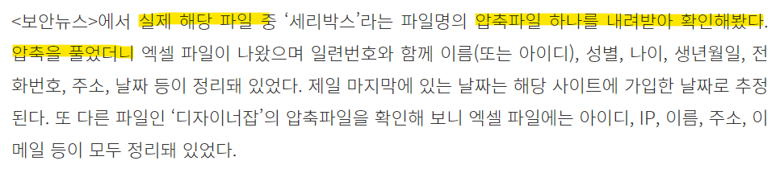

# 보안뉴스 기자의 범법 행위 가능성

https://boannews.com/media/view.asp?idx=132175


 

보안뉴스에서 **[긴급] 국내 웹사이트 20여곳 데이터 유출? 해커, DB 판매 의사 밝히며 샘플 공개** 라는 기사를 올렸다.

기사 내용을 살펴보니    
보안뉴스에서 실제 해당 파일을 내려받아 압축을 풀었다고 한다.

이러한 행위는 보안뉴스에서 해당 해킹 데이터를 수집한 것이 된다.

### 한 마디로 보안뉴스 기자가 개인정보 무단수집으로 범법행위를 한 것이다.
</br>

## Check 
- 보안뉴스 소관의 전자시스템(PC)에 인물들의 개인정보가 저장되었는가 
(O)

- 보안뉴스가 해당 개인정보 소유자에게 동의를 받았는가   
(X)

- 보안뉴스가 세리박스와 개인정보 위탁계약을 체결하였는가    
(X)

- 기사 작성 목적에 맞게 최소한의 개인정보만 수집했는가      
(X)

- 저 행위가 개인정보 소유자의 생명, 재산상 이익을 보호하기 위해 긴급하게 진행해야 할 정도로 필요한가    
(?)


</br>

## 생각
위와 같은 공익 목적의 기사를 작성하는 기자는    
저러한 개인정보를 무단으로 수집해도 괜찮은 것인가? 에 대한   
의구심을 품을 수 있다. 

개인적인 생각으로는 경찰같은 국가 기관에서   
수사 목적으로 개인정보를 수집하는 것은 괜찮다고 생각한다.   
또한 최초발견을 하여 신고 목적으로 확인하는 것 또한 어쩔 수 없기에 괜찮다고 생각한다.

하지만 너도 나도 신고 목적으로 타인의 개인정보를 봤다고 한다면 할 말이 없을 것이다.   
그렇기에 가능한 유출된 파일을 확인하지 않는 것이    
개인정보를 보호 해야 하는 보안인으로서 지켜야 할 덕목이라 생각한다.

</br>
</br>

## 개인정보보호법
```
제15조(개인정보 수집ㆍ이용)
① 개인정보처리자는 다음 각 호의 어느 하나에 해당하는 경우에는 개인정보를 수집할 수 있으며 그 수집 목적의 범위에서 이용할 수 있다.
1. 정보주체의 동의를 받은 경우

2. 법률에 특별한 규정이 있거나 법령상 의무를 준수하기 위하여 불가피한 경우

3. 공공기관이 법령 등에서 정하는 소관 업무의 수행을 위하여 불가피한 경우

4. 정보주체와 체결한 계약을 이행하거나 계약을 체결하는 과정에서 정보주체의 요청에 따른 조치를 이행하기 위하여 필요한 경우

5. 명백히 정보주체 또는 제3자의 급박한 생명, 신체, 재산의 이익을 위하여 필요하다고 인정되는 경우

6. 개인정보처리자의 정당한 이익을 달성하기 위하여 필요한 경우로서 명백하게 정보주체의 권리보다 우선하는 경우. 이 경우 개인정보처리자의 정당한 이익과 상당한 관련이 있고 합리적인 범위를 초과하지 아니하는 경우에 한한다.

7. 공중위생 등 공공의 안전과 안녕을 위하여 긴급히 필요한 경우
``` 
```
제16조(개인정보의 수집 제한) 
① 개인정보처리자는 제15조제1항 각 호의 어느 하나에 해당하여 개인정보를 수집하는 경우에는 그 목적에 필요한 최소한의 개인정보를 수집하여야 한다. 이 경우 최소한의 개인정보 수집이라는 입증책임은 개인정보처리자가 부담한다.
```
</br>
</br>

## 보안뉴스 기사 전문
