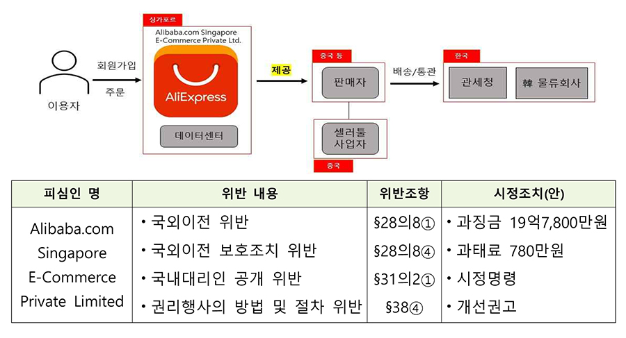
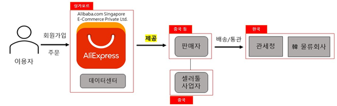
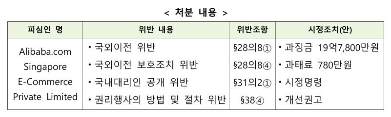

# 알리 익스프레스 개인정보 국외이전 위반

 

## 정리
알리익스프레스는    
1. 개인정보를 국외로 제공(이전)할 때 개인정보 보호법에서 정한 고지사항을 한국 이용자들에게 고지하지 않았다   
2. 개인정보 보호법 시행령에 해당하는 판매자 약관 등에 개인정보 보호에 필요한 조치를 반영하지 않았다   
3. 회원 탈퇴 메뉴를 찾기 어렵게 구성하고, 계정삭제 페이지를 영문으로 표시하는 등 이용자의 권리행사를 어렵게 하였다
4. 그렇기에 과징금 19억7,800만원, 과태료 780만원, 시정명령, 개선권고를 한다.
    - ①개인정보 처리 흐름을 최대한 투명하고 알기 쉽게 정보주체에게 공개하고, 변동 시 신속하게 현행화할 것.  
    - ②국내대리인의 단순 지정을 넘어 개인정보 보호를 위한 실질적 운영 노력을 기울이며, 특히 개인정보 처리와 관련한 불만의 해결 및 피해를 구제할 수 있도록 구체적인 방안을 마련‧시행할 것.
    - ③보호법상 원칙에 따라 수집하는 개인정보를 최소화하고, 국내 전자상거래(이커머스) 기업들이 운영 중인 민관협력 자율규약에 참여하거나 그에 준하는 수준의 개인정보보호를 제공할 것을 개선권고하였다.


---
# 알리익스프레스에 개인정보 보호법 위반으로 19억7,800만원 과징금 부과

https://www.pipc.go.kr/np/cop/bbs/selectBoardArticle.do?bbsId=BS074&mCode=C020010000&nttId=10386#LINK   

<조사 배경>

그동안 개인정보위는 “해외직구 서비스가 급증하며 우리 국민의 개인정보 침해 우려가 크다”는 국회 국정감사(’23.10월) 지적과 언론보도 등에 따라 관련 조사를 진행해 왔다.

<조사 결과>

알리익스프레스는 입점 판매자가 이용자에게 상품을 판매할 수 있도록 플랫폼을 제공하고, 상품 판매 금액의 일정 비율을 중개수수료로 받는 전형적인 ‘열린장터(오픈마켓)’로, 이용자가 상품을 구매하면 판매자가 상품을 배송하도록 이용자의 개인정보를 국외 판매자에게 제공(이전)하는데, 그간 한국 이용자의 개인정보를 제공받은 중국 판매자는 18만여 개에 이르는 것으로 확인되었다.



이렇게 국외로 제공되는 개인정보는 보호법에 따른 보호조치를 적용받기 어려워, 우리 보호법은 사업자로 하여금 정보주체가 그 사실을 명확히 알 수 있도록 동의를 받고, 판매자와의 계약내용 등에 안전성 확보조치, 개인정보 침해에 대한 고충처리 및 분쟁해결에 관한 조치 등을 반영하도록 하고 있다.

```
< 보호법 >

제28조의8(개인정보의 국외 이전) ① 개인정보처리자는 개인정보를 국외로 제공(조회되는 경우를 포함한다)ㆍ처리위탁ㆍ보관(이하 이 절에서 “이전”이라 한다)하여서는 아니 된다. 다만, 다음 각 호의 어느 하나에 해당하는 경우에는 개인정보를 국외로 이전할 수 있다.   
1. 정보주체로부터 국외 이전에 관한 별도의 동의를 받은 경우
④ 개인정보처리자는 제1항 각 호 외의 부분 단서에 따라 개인정보를 국외로 이전하는 경우 국외 이전과 관련한 이 법의 다른 규정, 제17조부터 제19조까지의 규정 및 제5장의 규정을 준수하여야 하고, 대통령령으로 정하는 보호조치를 하여야 한다.


< 보호법 시행령 >

제29조의10(개인정보의 국외 이전 시 보호조치 등) ① 개인정보처리자는 법 제28조의8제1항 각 호 외의 부분 단서에 따라 개인정보를 국외로 이전하는 경우에는 같은 조 제4항에 따라 다음 각 호의 보호조치를 해야 한다. 
1. 제30조제1항에 따른 개인정보 보호를 위한 안전성 확보 조치    
2. 개인정보 침해에 대한 고충처리 및 분쟁해결에 관한 조치    
3. 그 밖에 정보주체의 개인정보 보호를 위하여 필요한 조치    
② 개인정보처리자는 법 제28조의8제1항 각 호 외의 부분 단서에 따라 개인정보를 국외로 이전하는 경우에는 제1항 각 호의 사항에 관하여 이전받는 자와 미리 협의하고 이를 계약내용 등에 반영해야 한다.
```

그러나, 알리익스프레스는 ‘개인정보가 이전되는 국가’, ‘개인정보를 이전받는 자의 성명(법인명) 및 연락처’ 등 보호법에서 정한 고지사항을 이용자에게 알리지 않았으며, 판매자 약관 등에 개인정보 보호에 필요한 조치를 반영하지 않았다. 또한, 회원 탈퇴 메뉴를 찾기 어렵게 구성하고, 계정삭제 페이지를 영문으로 표시하는 등 이용자의 권리행사를 어렵게 하였다.

<처분내용>

이에 따라 개인정보위는 알리익스프레스에 대해 개인정보의 국외이전과 관련한 보호법 규정 위반 등으로 과징금 및 과태료를 부과하고 개인정보를 이전받는 자(국외 판매자 등)에 의한 오남용을 예방하도록 우리 보호법상 요구되는 조치를 계약 등에 반영할 것과 회원 탈퇴 절차를 간소화하는 등 이용자가 권리행사를 쉽게 할 수 있도록 조치할 것을 시정명령하였다.


※ 조사 과정에서 알리익스프레스는 법정 요건을 갖춰 국외이전에 대한 이용자 동의를 받는 등 보호법상 합법 근거를 마련하고, 국내대리인 공개 관련 미흡 사항을 개선하였으며, 개인정보 처리방침을 개정하는 등 자진 시정조치를 취함

이와 아울러 개인정보위는 국내 이용자의 개인정보 보호 수준을 제고하기 위해 ①개인정보 처리 흐름을 최대한 투명하고 알기 쉽게 정보주체에게 공개하고, 변동 시 신속하게 현행화할 것, ②국내대리인의 단순 지정을 넘어 개인정보 보호를 위한 실질적 운영 노력을 기울이며, 특히 개인정보 처리와 관련한 불만의 해결 및 피해를 구제할 수 있도록 구체적인 방안을 마련‧시행할 것 ③보호법상 원칙에 따라 수집하는 개인정보를 최소화하고, 국내 전자상거래(이커머스) 기업들이 운영 중인 민관협력 자율규약에 참여하거나 그에 준하는 수준의 개인정보보호를 제공할 것을 개선권고하였다.

개인정보위는 시정명령 및 개선권고 사항에 대한 이행 여부를 지속 점검하여 우리 국민의 개인정보가 침해되지 않도록 조치해 나갈 계획이다.

이번 조사‧처분은 해외 이커머스 사업자라 하더라도 국내 이용자를 대상으로 서비스하는 경우 우리 보호법의 적용대상이 될 뿐만 아니라 국내 사업자 수준의 개인정보 보호 및 관리가 요구된다는 점을 명확히 하였다는 데 의의가 있다. 특히 개인정보를 국외로 이전하는 경우 보호법이 정하고 있는 의무사항을 충실히 이행하는 한편, 입점 판매자 등과의 관계에서도 적절한 보호‧안전 조치를 취함으로써 정보주체의 개인정보자기결정권 보장에 만전을 기하는 계기가 될 것으로 기대한다.
