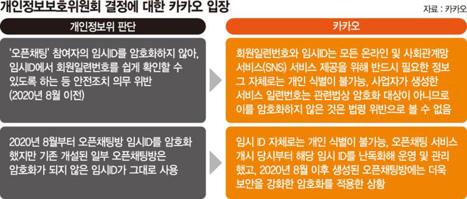

# 카카오톡 오픈채팅 이용자 개인정보 유출사고

유출사고 과정


## 정리
### 사건 발생
1. 일반채팅과 오픈채팅을 이용하는 이용자를 동일한 회원일련번호로 식별할 수 있는 식별체계를 구현하였음
2. 20.8월 이전에 생성된 오픈채팅방은 임시ID를 암호화하지 않아 회원일련번호(,오픈채팅방명, 닉네임)가 그대로 노출되었음
3. 20.8월 이후에 생성된 오픈채팅방은 임시ID를 암호화하였지만, 특정 조건에서 암호화를 해제하고 평문으로 임시ID를 노출하는 취약점이 존재하였음
4. 오픈채팅에서 획득한 회원일련번호를 토대로 일반채팅에서 '친구 추가'기능으로 일반채팅 이용자 정보(회원일련번호, 휴대전화번호, 프로필명)를 획득가능했고, 불법프로그램으로 대량 정보 조회를 하였음
5. 카카오톡 회원일련번호를 매개로 양 정보를 결합해서 특정 오픈채팅 방의 DB 완성 및 판매하였음.(참여자 이름(실명), 휴대전화번호, 오픈채팅 방 닉네임 등 포함)

### 개인정보위원회 의결
1. 카카오톡 오픈채팅 방 임시ID를 암호화하지 않아 회원일련번호를 쉽게 확인 가능했고
2. 개발자 커뮤니티 등에 API를 이용한 이용자 정보 추출 방법이 공개됐음에도 피해 가능성 검토 및 개선 조치가 미흡하였기에
3. 개인정보위원회는 카카오에게 안전조치의무 위반 과징금 151억4,196만원, 유출 신고 통지 의무 위반 과태료 780만원, 시정명령, 결과공표를 의결하였음

### 카카오 입장
1. 회원일련번호나 임시ID는 모든 온라인 및 모바일 서비스 제공을 위해 반드시 필요한 정보이고 그 자체로는 어떤 개인정보도 포함하고 있지 않고, 이것만으론 개인 식별이 불가능하다.
2. 사업자가 생성한 서비스 일련번호는 관련법상 암호화 대상이 아니기 때문에 이를 암호화하지 않은 것도 법령 위반이라고 볼 수 없다
3. 20.8월 이전에 생성된 오픈채팅방의 임시ID는 그 자체로는 개인 식별이 불가능해 개인정보라고 판단할 수 없다.


오픈채팅방 DB 추출이 가능하다던 업체 광고 사진

[출처](https://www.kyungnam.ac.kr/bbs/mis/476/105204/artclView.do)

개인정보위원회 판단과 카카오 입장

[출처](https://www.msn.com/ko-kr/news/other/151%EC%96%B5-%EA%B3%BC%EC%A7%95%EA%B8%88-%ED%8F%AD%ED%83%84%EC%97%90-%EC%B9%B4%EC%B9%B4%EC%98%A4-%EA%B0%9C%EC%9D%B8%EC%A0%95%EB%B3%B4-%EC%9C%A0%EC%B6%9C-%EC%95%84%EB%8B%88%EB%8B%A4-%EC%86%8C%EC%86%A1/ar-BB1mU2VA?apiversion=v2&noservercache=1&domshim=1&renderwebcomponents=1&wcseo=1&batchservertelemetry=1&noservertelemetry=1)


개인정보위원회와 카카오 입장 차이

[출처](https://www.seoul.co.kr/news/economy/IT/2024/06/07/20240607020012)

```
개인정보 보호법 제2조(정의)
1. “개인정보”란 살아 있는 개인에 관한 정보로서 다음 각 목의 어느 하나에 해당하는 정보를 말한다.
나. 해당 정보만으로는 특정 개인을 알아볼 수 없더라도 다른 정보와 쉽게 결합하여 알아볼 수 있는 정보. 이 경우 쉽게 결합할 수 있는지 여부는 다른 정보의 입수 가능성 등 개인을 알아보는 데 소요되는 시간, 비용, 기술 등을 합리적으로 고려하여야 한다.
```

### 내 생각
개인정보 보호법 제2조에서는 쉽게 결합할 수 있는지 여부를 고려한다고 기재되어 있다.    
여기서 "쉽게 결합할 수 있는지"가 중요할 것으로 보인다.    
임시ID와 회원일련번호를 얻는 것은    
20.8월 이전에 생성된 암호화가 되지 않은 오픈채팅 방 기준에서는 쉽게 획득 가능하고,    
20.8월 이후에도 오픈채팅방의 게시판에 임시ID를 입력하면 암호화가 해제되고 평문으로 노출되는 취약점으로 쉽게 획득이 가능한 점.       
카카오톡 친구 추가 기능을 이용하여 회원일련번호와 이름, 휴대전화번호를 확인할 수 있는 것은 카카오톡 기능만을 이용하여도 가능한 것이기에 "쉽게 결합할 수 있다"고 생각한다.
```
개인정보 보호법 제2조(정의)
1. “개인정보”란 살아 있는 개인에 관한 정보로서 다음 각 목의 어느 하나에 해당하는 정보를 말한다.
나. 해당 정보만으로는 특정 개인을 알아볼 수 없더라도 다른 정보와 쉽게 결합하여 알아볼 수 있는 정보. 이 경우 쉽게 결합할 수 있는지 여부는 다른 정보의 입수 가능성 등 개인을 알아보는 데 소요되는 시간, 비용, 기술 등을 합리적으로 고려하여야 한다.
```
</br></br></br>

---
# 개인정보위, ㈜카카오에 과징금 151억 원, 과태료 780만 원 부과
https://www.pipc.go.kr/np/cop/bbs/selectBoardArticle.do?bbsId=BS074&mCode=C020010000&nttId=10180#LINK   

개인정보보호위원회(위원장 고학수, 이하 ‘개인정보위’)는 5월 22일(수) 제9회 전체회의를 열고, 개인정보보호 법규를 위반한 ㈜카카오에 대해 151억 4,196만 원의 과징금과 780만 원의 과태료를 부과하고, 시정명령과 처분결과를 공표하기로 의결하였다.

개인정보위는 지난해 3월 카카오톡 오픈채팅 이용자의 개인정보가 불법 거래되고 있다는 언론보도에 따라 개인정보 보호법 위반 여부를 조사하였다. 

조사 결과, 해커는 오픈채팅방의 취약점을 이용해 오픈채팅방 참여자 정보를 획득했고, 카카오톡의 친구추가 기능과 불법 프로그램 등을 이용해 이용자 정보를 확보하였으며, 이들 정보를 ‘회원일련번호’를 기준으로 결합해 개인정보 파일을 생성, 판매한 것으로 확인되었다.


< 개인정보 유출 과정 >


개인정보위는 ㈜카카오가 카카오톡 서비스를 제공하는 과정에서 다음과 같은 위반 사실을 확인하였다.

< 안전조치의무 위반 >

먼저, ㈜카카오는 익명채팅이라고 홍보하며 오픈채팅 서비스를 운영하였는데, 일반채팅과 오픈채팅을 이용하는 이용자를 동일한 회원일련번호로 식별할 수 있게 이용자 식별체계를 구현하였다. 다만, 오픈채팅 참여자는 오픈채팅방 정보(오픈채팅방 ID)와 회원일련번호로 구성한 임시ID를 메시지 송수신시 사용하였다.  
  
’20. 8월 이전에 생성된 오픈채팅방은 참여자의 임시ID를 암호화하지 않아, 임시ID에서 회원일련번호를 쉽게 확인할 수 있었다. 

또, ’20. 8월 이후에 생성된 오픈채팅방은 임시ID를 암호화하였지만, 오픈채팅방 게시판에 암호화된 임시ID를 입력하면 암호화를 해제하고 평문으로 임시ID를 노출하는 취약점이 있어, 참여자의 암호화된 임시ID도 쉽게 회원일련번호를 확인할 수 있었다. 

이와 같이, ㈜카카오는 카카오톡 서비스 설계‧운영 과정에서 회원일련번호와 임시ID가 연계되어 오픈채팅의 익명성이 훼손 또는 개인정보 노출될 가능성이 있음에도 그에 대한 검토와 개선 조치를 소홀히 한 것이다. 마찬가지로, 오픈채팅방 게시판에 있던 보안 취약점에 대한 점검과 개선조치를 소홀히 하였다. 

회원일련번호 연계에 따른 익명성 훼손을 방지하려면 오픈채팅 이용자는 일반채팅과 다른 식별체계로 구성하거나, 임시ID를 암호화해 회원일련번호가 노출되지 않도록 하는 방법 등이 가능하다. ㈜카카오는 지난해 사고 발생 이후 모든 오픈채팅방 참여자의 임시ID를 암호화하였다. 

또, 카카오톡 전송방식을 분석한 공개된 API를 이용하면 이용자 정보 추출 등이 가능하다는 지적이 개발자 커뮤니티 등에 공개되어 왔음에도 불구하고, ㈜카카오는 관련 내용이 카카오톡 서비스에 비치는 영향, 개인정보 유출 등 피해 가능성에 대한 검토와 개선 조치도 미흡하였다.
오픈채팅 서비스 설계‧구현 과정에서의 과실과 카카오톡 전송방식을 분석해서 만든 해킹 프로그램을 이용한 악성행위에 대한 대응조치 미흡 등으로 인해서 ㈜카카오가 처리 중인 개인정보가 해커에게 공개‧유출되었고, 따라서 ㈜카카오는 개인정보 보호법의 안전조치 의무를 위반하였다. 

< 유출 신고·통지 의무 위반 >

또한, ㈜카카오는 ’23. 3월 언론보도 및 개인정보위 조사과정에서 카카오톡 오픈채팅방 이용자의 개인정보가 유출되고 있다는 사실을 인지했음에도 유출 신고와 이용자 대상 유출 통지를 하지 않아 개인정보 보호법을 위반하였다.

개인정보위는 이용자 개인정보가 유출된 ㈜카카오에 대해 안전조치의무 위반으로 과징금을 부과하고, 유출 신고·통지의무 위반 등에 대해서는 과태료를 부과하기로 결정하였다.

또, ㈜카카오에 이용자 대상 유출 통지를 할 것을 시정명령하는 동시에, 개인정보위 홈페이지에 처분 결과를 공표하기로 결정하였다.

이번 처분을 계기로 카카오톡과 같이 대다수 국민이 이용하는 서비스의 경우 보안 취약점을 상시적으로 점검‧개선하는 한편 설계‧개발 과정에서 발생할 수 있는 개인정보 침해 가능성에 대해서도 지속적인 점검과 노력이 필수적이라는 인식이 자리잡기를 기대한다고 개인정보위는 밝혔다.

