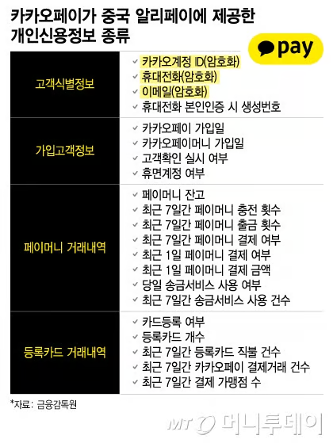
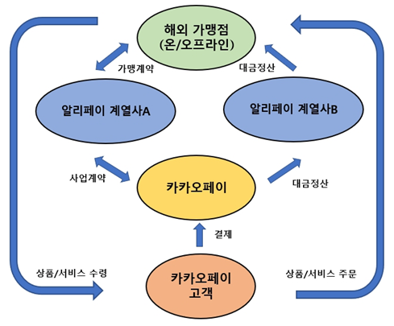
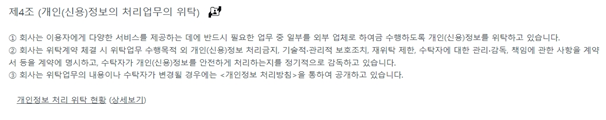

# 카카오페이 4000만명의 고객 정보 알리페이에 제공
카카오페이가 중국 알리페이에 제공한 개인신용정보 종류   
    
[출처]https://news.mt.co.kr/mtview.php?no=2024081310580477017    
</br></br></br>

# 금융감독원 보도자료
---
### ① 카카오페이 전체 고객 개인신용정보 제공
1. 카카오페이는 中 알리페이와 제휴를 통해, 국내 고객이 알리페이가 계약한 해외가맹점에서 카카오페이로 결제할 수 있는 서비스를 제공
2. 카카오페이는 알리페이가 NSF 스코어 산출(애플社가 제휴 선결조건으로 요청)을 명목으로 카카오페이 전체 고객의 신용정보를 요청
3. 해외결제를 이용하지 않은 고객까지 포함한 “카카오페이에 가입한 전체고객의 개인신용정보”를 고객 동의 없이 ’18.4월부터 지금까지 매일 1회, 총 542억건(누적 4,045만명) 알리페이에 제공
4. NSF 스코어 산출 명목이라면 관련모형 구축(19.6월) 이후에는 스코어 산출대상 고객의 신용정보만 제공하여야 함에도, 전체고객의 신용정보를 계속 제공하고 있어 고객정보 오남용이 우려되는 상황
</br>

### ② 알리페이 대금정산 시 이용고객 신용정보 제공 
1. 카카오페이는 국내 고객이 해외가맹점에서 카카오페이로 결제시 알리페이에 대금정산을 해주기 위해서는, 알리페이와 주문ㆍ결제정보만 공유하면 되는데
2. ’19.11월부터 지금까지 해외결제고객의 신용정보를 불필요하게 알리페이에 5.5억건(누적) 제공
3. 동의서 상 제공받는 자(알리페이)의 이용목적을 ”PG업무(결제승인/정산) 수행“으로 사실과 다르게 기재하여 “제공받는 자의 실제 이용목적”을 제대로 고지하지 않음
4. 고객이 동의하지 않으면 해외결제를 못하는 사안이 아님에도 선택적 동의사항이 아닌 필수적 동의사항으로 잘못 동의를 받아 옴
</br>


#### NSF 스코어 산출을 이유로 제공한 개인신용정보 내역
- (고객식별정보)해시처리한 “카카오계정 ID/핸드폰 번호/이메일”, 해시처리하지 않은 “핸드폰 본인인증시 생성번호”(Device ID)
- (가입고객정보)카카오페이 가입일, 카카오페이 머니(이하 ‘페이머니’) 가입일, 고객확인(KYC) 실시 여부, 휴면계정 여부
- (페이머니 거래내역)페이머니 잔고, 최근 7일간 페이머니 충전 횟수, 최근 7일간 페이머니 출금 횟수, 최근 7일간 페이머니 결제 여부, 최근 1일 페이머니 결제 여부, 최근 1일 페이머니 결제 금액, 당일 송금서비스 사용 여부, 최근 7일간 송금서비스 사용 건수
- (등록카드 거래내역)카드등록 여부, 등록카드 개수, 최근 7일간 등록카드 직불 건수, 최근 7일간 카카오페이 결제거래 건수 및 결제 가맹점 수

#### 대금정산 시 제공한 이용고객 신용정보
- 카카오계정 ID 및 마스킹한 이메일 또는 전화번호(정기결제시)
- 주문정보(시간, 통화, 금액, 거래유형 등)/결제정보(시간, 통화, 금액, 결제수단 등)

카카오페이의 알리페이와의 해외결제업무 취급 구조   
   
[출처]금융감독원 보도자료

금융감독원 '카카오페이의 해외결제부문에 대한 현장검사 결과' 보도자료   
https://www.fss.or.kr/fss/bbs/B0000188/view.do?nttId=137604&menuNo=200218&cl1Cd=&sdate=&edate=&searchCnd=1&searchWrd=&pageIndex=5
</br></br>

# 카카오페이 입장문
---
1. 애플 앱스토어 결제 시 안전한 결제 환경을 구축하기 위해 애플, 알리페이와 3자 협력을 통해 부정 결제 방지 절차를 마련
2. 카카오페이는 알리페이와의 업무 위수탁 관계에 따라 개인을 특정할 수 없도록 비식별화된 정보를 제공하고 애플에서 해당 데이터를 활용해 부정 결제 여부 등을 판단
3. 원문 데이터를 유추하거나 복호화 될 수 없는 방식으로 보내고 있어 알리페이나 애플이 원래의 목적과 관계없는 용도로 활용은 불가능
4. 다만, 카카오페이는 금융감독원 조사 과정임을 감안하여 지난 5월 22일부터 협력사 양해를 거친 후 해당 정보 제공을 잠정 중단

카카오페이, 금융감독원 보도자료에 대한 입장문   
https://www.kakaopay.com/news/notice_detail?id=3345&page=1
</br></br>

# 금융감독원, 카카오페이 입장문에 대한 반박
---
### ① 신용정보의 처리 위탁 해당여부
1. 카카오페이가 알리페이와 체결한 일체의 계약서를 확인한 결과, 카카오페이가 알리페이에게 ”NSF스코어 산출․제공업무“를 위탁하는 내용은 전혀 존재하지 않음
```
< 카카오페이-알리페이 계약서 >
①해외결제사업 계약서(2건) : Participation Agreement, Business Cooperation Agreement
②아웃바운드(온라인/오프라인) 계약서(4건) : Settlement Services Agreement, Cross-Border Barcode Payment Business Cooperation Agreement, Payment Service Agreement, Technical Service Agreement
③인바운드(온라인/오프라인) 계약서(1건) : Alipay Service Contract 
④기타(2건) : Services Agreement, Pledge for Protection of Personal Information
```
2. 카카오페이가 회원가입시 징구하는 약관 및 해외결제시 징구하는 동의서를 확인한 결과, ”NSF스코어와 관련한 고객정보 제공“을 유추할 수 있는 내용이 전혀 존재하지 않음
```
국내 고객이 해외가맹점에서 카카오페이로 결제시 알리페이와 대금정산을 위해서는, 주문․결제정보만 공유하면 되는데도, 본 동의서를 통해 해외결제고객의 신용정보를 불필요하게 알리페이에 제공 ⇨ 관련법령 위반에 해당
```
3. 카카오페이가 동사 홈페이지에 공시한 “개인신용정보 처리업무 위탁” 사항에도 ”NSF스코어 산출․제공업무“는 포함되어 있지 않음

홈페이지 공시내용(발췌)   
    
[출처][카카오페이 개인정보처리방침](https://www.kakaopay.com/terms/privacy)

4. 대법원 판례* 등에 의거, “신용정보의 처리 위탁”이 되기 위해서는    
➊위탁자 본인의 업무처리와 이익을 위한 경우로서,    
➋수탁자는 위탁사무처리 대가 외에는 독자적인 이익을 가지지 않고,    
➌위탁자의 관리․감독 아래에서 처리한 경우 등에 해당해야 하는 바, 본건은 이에 해당하지 않음

5. 「금융회사의 정보처리 업무 위탁에 관한 규정」제7조에 의거, 정보처리 업무 위수탁시 금감원에 사전 보고해야 함에도, 본건은 감독당국에 보고한 바 없음

### ② 원본 데이터 유추 가능 여부
1. 카카오페이는   
①공개된 암호화 프로그램 중 가장 일반적으로 통용되는 암호화 프로그램(SHA256)을 사용하였고,    
②해시처리(암호화) 함수에 랜덤값을 추가하지 않고 해당정보(전화번호, 이메일 등) 위주로만 단순하게 설정   
③해시처리(암호화) 함수를 지금까지 한번도 변경한 사례가 없음   
가장 일반적인 암호화 프로그램으로 일반인도 복호화가 가능한 수준으로 원본 데이터 유추가 가능합니다.
2. 알리페이가 애초 카카오페이에 개인신용정보(핸드폰, 이메일 등)를 요청한 이유는 동 정보를 애플ID에 매칭하기 위한 것    
애플ID에 매칭하기 위해서는 카카오페이가 제공한 개인식별정보를 복호화해야 가능하기 때문에   
알리페이가 애플에 “특정 카카오페이 고객의 NSF스코어를 제공”하면서, 개인신용정보를 식별하지 않는다는 주장은 모순


### ③ 신용정보 부당제공에 대한 처벌 강화
1. 애플스토어 입점은 카카오페이와 알리페이 모두에게 이익(PG사 수수료)이 되는 업무로, 위탁자 본인의 이익을 위한 경우에 해당되지 않음
2. 카카오페이에 PG결제 등을 위해 가입한 고객이 본인의 개인정보가 애플스토어 입점 때문에 국외로 제공될 수 있다는 사실을 가입시 인지하기 어려움
3. 카카오페이가 알리페이를 관리ㆍ감독한 사실이 없음
4. 카카오페이와 알리페이간 NSF 스코어 산출·제공 관련 계약서가 존재하지 않아 손해배상 책임 부담 주체는 확인하기 어려움
5. 카카오페이는 본 건 관련 위수탁 내용을 공시한 바 없으며, 관련 내용을 감독당국에 보고한 바 없음

「카카오페이 '동의 필요없는 정보이전...위법 아냐'」 기사에 대한 설명    
https://www.fss.or.kr/fss/bbs/B0000188/view.do?nttId=137657&menuNo=200218&cl1Cd=&sdate=&edate=&searchCnd=1&searchWrd=&pageIndex=5