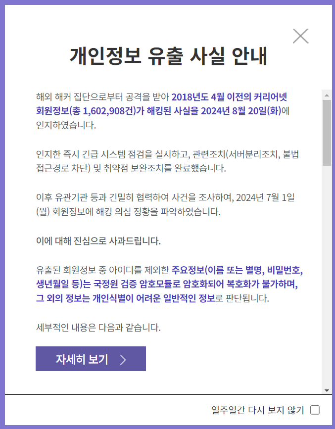

# 커리어넷 개인정보 유출
### 커리어넷, 개인정보 유출 인정... 악명 높은 해커 ‘인텔브로커’에게 160만건 털렸다
https://boannews.com/media/view.asp?idx=132247
  

'인텔브로커(IntelBroker)'가 지난 8월 15일 커리어넷 사이트를 해킹했다고 주장했다.

인텔브로커는 개인정보 샘플을 공개하고 판매글을 업로드를 하였다.

커리어넷은 “해외 해커 집단으로부터 공격을 받아 2018년 4월 이전의 커리어넷 회원정보(총 1,602,908건)가 해킹된 사실을 지난 20일 인지했다”며    
"긴급 시스템 점검을 실시, 서버분리조치, 불법 접근경로 차단, 취약점 보완조치를 완료했다"고 밝혔다.
  

### 커리어넷 해킹 공격, 암호화 풀려 2차 피해 우려
https://www.etnews.com/20240825000060

개인정보가 유출된 이후 2차 피해가 우려되고 있다.    

"유출된 회원정보 중 아이디를 제외한 주요 정보(이름 또는 별명, 비밀번호, 생년월일 등)는 국가정보원 검증 암호모듈로 암호화해 복호화가 불가하다"면서 "그외 정보는 개인 식별이 어려운 일반 정보로 판단된다"고 설명했다.

그러나 유출된 정보가 암호화됐다고 하지만 이를 쉽게 해제(크랙)할 수 있는 것으로 나타났다.

본지가 인텔브로커에 직접 메일을 보내 탈취한 자료의 크랙 여부를 문의한 결과,    
"크랙이 어렵지 않다"며 암호를 푼 샘플을 보냈다.   
국내 보안 전문가들도 인텔브로커가 공개한 자료를 가지고 <U>쉽게 크랙할 수 있는 것으로 확인</U>됐다.

보안전문가는 "대개 암호화 알고리즘에 솔트(Salt·랜덤값)를 더해 보안성을 강화한다"면서    
"커리어넷은 일반적인 암호화 알고리즘 'SHA-256'을 사용했고 <U>솔트를 적용하진 않은 것으로 보인다</U>"고 말했다.

"한국인터넷진흥원(KISA) 등도 추가적으로 솔트를 적용하지 않은 경우 패스워드 암호화를 제대로 하지 않은 것으로 간주한다"며   
“해커가 자동화 프로그램을 통해 탈취한 자료 대부분을 손쉽게 크랙할 수 있을 것"이라고 덧붙였다.

인텔브로커가 제시한 커리어넷 자료의 판매가격은 2만달러(약 2600만원)로,    
다크코인 모네로(XMR)로 거래하자고 요구했다.    
160만명의 개인정보가 포함된 점을 감안하면 1건당 16원정도다.

개인정보 보호에 대한 관심 부족이 드러났다.  
<U>경영지원본부장이 개인정보보호책임자(CPO)를</U>, <U>지식정보팀 인력이 개인정보보호 담당자를</U> 맡는 등    
보안 전문성이 떨어진다는 지적이다.    
홈페이지 유지·관리와 회원 데이터베이스(DB) 관리도 민간기업에 맡겨 운영하고 있다.

공공기관에서 정보보호 사고가 잇따라 발생하는 만큼 최고정보보호책임자(CISO) 의무화 등 제도 개선이 필요하다

